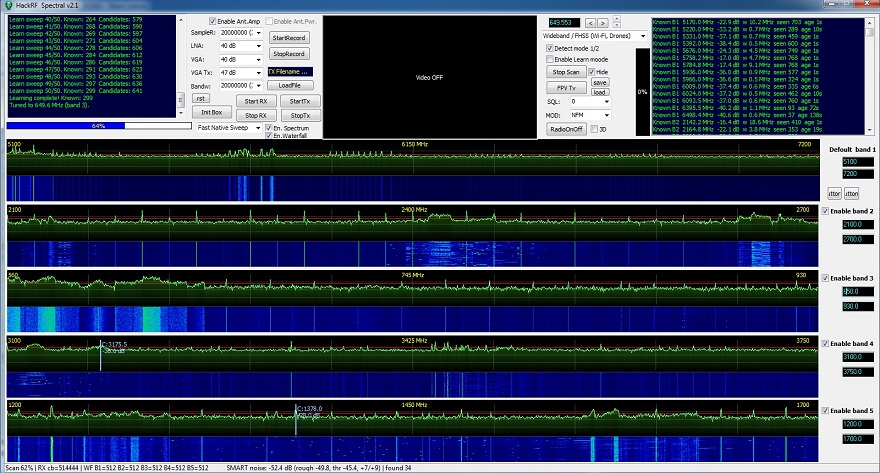

EN:

## Overview

The program integrates a wideband spectrum scanner, signal analyzer, multi-mode demodulator, and an intelligent signal detection system powered by machine learning.

### Wideband Spectrum Scanning
- Simultaneous scanning of up to 5 frequency bands
- Frequency Range: 1 MHz – 7.25 GHz (Full HackRF range)
- Configurable scan bandwidth and sampling rate up to 20 MSPS
- Real-time spectrum visualization with gradient fill
- Waterfall display for each band with power color-coding
- 3D Spectrum — three-dimensional spectral representation with time accumulation
- Multiple scanning profiles: Fast, Balanced, Quality, Native Sweep

### Intelligent Signal Detection
- Two detection modes: Simple (fast) and Smart (accurate)
- Three-level threshold system:
  - Automatic noise floor calculation (Smart mode)
  - DC Notch filter to suppress zero-frequency artifacts
  - Weighted central frequency signal detection
  - Ignore-list system to exclude known interference sources

### Signal Learning and Classification System
- **Learning Mode**: automatic memorization of background signals
- **Signal Classification**:
  - `Known` — known/background signals (Green markers)
  - `New` — new confirmed signals (Red markers)
  - `Candidate` — pending confirmation signals (Orange markers)
  - `Raw` — unprocessed findings (Gray markers)
- Automatic aging and removal of outdated candidates
- Configurable signal confirmation thresholds

### Multi-mode Demodulator
- Modulations: WFM, FM, AM, SSB
- FPV WFM Video: capture and display video feed
- Real-time demodulated audio playback
- RSSI measurement with visual signal strength indicator
- IQ data recording to file for subsequent analysis
- Transmission of IQ files over the air **Strictly on authorized frequencies!**

## Areas of Application

### Security and Counterintelligence
- Detection of hidden transmitters (bugs, covert devices) in rooms
- Search for unauthorized wireless devices in protected zones
- Radio frequency environment monitoring on critical infrastructure objects
- FPV drone detection via control radio signals and video links
- Identification of jammers and interference in the RF spectrum
- Airwave control at special events and negotiations

### Radio Monitoring and Regulation
- Monitoring frequency spectrum usage for regulatory bodies
- Detection of illegal radio stations and transmitters
- Interference control for licensed radio services
- Electromagnetic environment profiling for territories and objects
- Monitoring frequency band utilization levels
- Searching for RF interference sources for civil and specialized services

### Education and Research
- Teaching the basics of radio engineering and signal processing
- Laboratory work for radio electronics and telecommunications courses
- RF spectrum research in scientific projects
- Demonstration of modulation/demodulation principles (AM, FM, SSB)
- Studying FFT and digital signal processing (DSP) principles
- Prototyping and testing new detection algorithms

### Industry and Telecommunications
- Testing and tuning of radio transmitters and antennas
- Electromagnetic Compatibility (EMC) equipment analysis
- Monitoring base station operability in cellular networks
- Identifying interference sources for industrial equipment
- Testing IoT devices and their RF characteristics
- Communication channel quality control

### Ham Radio and Hobby
- Listening to ham radio bands (HF, VHF, UHF)
- Monitoring aviation band (118–136 MHz AM)
- Monitoring emergency services and trunking networks
- Analyzing remote control, fobs, and sensors signals (315/433/868 MHz)

### Anti-Drone Systems
- Detection of drone control channels (900 MHz, 1.2 GHz, 2.4 GHz, 5.8 GHz)
- Detection of FPV video links (analog and digital)
- Drone type identification based on characteristic RF signatures
- Tracking FHSS signals (DJI, FrSky, CrossFire)
- Automated classification of new and known signals
- Integration with early warning systems

### Wireless Network Monitoring
- Wi-Fi channel load analysis (2.4 GHz and 5 GHz)
- Unauthorized Access Point (Rogue AP) detection
- Bluetooth and BLE device monitoring (2.4 GHz)
- Analysis of ZigBee, Z-Wave, and other IoT protocols
- Electromagnetic environment assessment in offices and residential buildings
- Wireless equipment placement planning

### Medicine and Specialized Applications
- EMF monitoring in operating rooms and laboratories
- Interference source search for medical equipment
- Monitoring wireless medical sensor operations
- Ensuring electromagnetic purity in zones with sensitive equipment.

RUS:

Программа объединяет в себе широкополосный сканер спектра, анализатор сигналов, 
многорежимный демодулятор и систему интеллектуального обнаружения сигналов с машинным обучением.

###  Широкополосное сканирование спектра
- Одновременное сканирование до 5 частотных диапазонов
- Диапазон частот: 1 МГц — 7.25 ГГц (полный диапазон HackRF)
- Настраиваемая полоса обзора и частота дискретизации до 20 MSPS
- Визуализация спектра в реальном времени с градиентной заливкой
- Водопад (Waterfall) для каждого диапазона с цветовой кодировкой мощности
- 3D Spectrum — трёхмерное отображение спектра с накоплением по времени
- Несколько профилей сканирования: Fast, Balanced, Quality, Native Sweep

###  Интеллектуальное обнаружение сигналов
- Два режима детектирования: Simple (быстрый) и Smart (точный)
- Трёхуровневая система порогов:
- Автоматический расчёт шумового пола (Smart режим)
- DC Notch фильтр для подавления артефакта нулевой частоты
- Взвешенное определение центральной частоты сигнала
- Система Ignore-List для исключения известных помех

###  Система обучения и классификации сигналов
- Режим обучения- Learning Mode : автоматическое запоминание фоновых сигналов
- Классификация сигналов:
 - Known  — известные/фоновые сигналы -зелёные маркеры
 - New  — новые подтверждённые сигналы -красные маркеры
- Candidate  — кандидаты на подтверждение -оранжевые маркеры
- Raw — необработанные находки -серые маркеры
- Автоматическое старение и удаление устаревших кандидатов
- Настраиваемые пороги подтверждения сигналов

###  Многорежимный демодулятор
- WFM FM AM SSB  -- модуляция
- FPV  WFM Video - для захвата и вывода изображения
- Воспроизведение демодулированного аудио в реальном времени.
- Измерение RSSI с визуальным индикатором уровня сигнала

-  Запись IQ-данных в файл для последующего анализа
- Передача IQ-файлов в эфир Строго на разрешенных частотах!

## Сферы применения

###  Безопасность и контрразведка
- Обнаружение скрытых передатчиков (жучков, закладок) в помещениях
- Поиск несанкционированных беспроводных устройств в защищённых зонах
- Мониторинг радиочастотной обстановки на объектах критической инфраструктуры
- Обнаружение FPV-дронов по их радиосигналу управления и видеолинка
- Выявление глушилок и помех в радиочастотном спектре
- Контроль радиоэфира на специальных мероприятиях и переговорах

###  Радиомониторинг и регулирование
- Мониторинг использования частотного спектра для регуляторных органов
- Обнаружение нелегальных радиостанций и передатчиков
- Контроль помех для легальных радиослужб
- Паспортизация электромагнитной обстановки территорий и объектов
- Мониторинг загруженности частотных диапазонов
- Поиск источников радиопомех для гражданских и специальных служб

###  Образование и исследования
- Обучение основам радиотехники и обработки сигналов
- Лабораторные работы по курсам радиоэлектроники и телекоммуникаций
- Исследование радиочастотного спектра в научных проектах
- Демонстрация принципов модуляции/демодуляции (AM, FM, SSB)
- Изучение принципов работы FFT и цифровой обработки сигналов
- Прототипирование и тестирование новых алгоритмов обнаружения

###  Промышленность и телекоммуникации
- Тестирование и настройка радиопередатчиков и антенн
- Анализ электромагнитной совместимости (ЭМС) оборудования
- Мониторинг работоспособности базовых станций сотовой связи
- Поиск источников помех для промышленного оборудования
- Тестирование IoT-устройств и их радиочастотных характеристик
- Контроль качества радиоканалов связи

###  Радиолюбительство и хобби
- Прослушивание радиолюбительских диапазонов (HF, VHF, UHF)
- Мониторинг авиационного диапазона (118-136 МГц AM)
- Мониторинг служб экстренной помощи и транковых сетей
- Анализ сигналов пультов ДУ, брелоков, датчиков (315/433/868 МГц)

###  Противодроновые системы
- Обнаружение каналов управления дронов (900 МГц, 1.2 ГГц, 2.4 ГГц, 5.8 ГГц)
- Обнаружение видеолинков FPV (аналоговые и цифровые)
- Идентификация типа дрона по характерному радиосигналу
- Отслеживание спекра FHSS-сигналов (DJI, FrSky, CrossFire)
- Классификация новых и известных сигналов в автоматическом режиме
- Интеграция с системами раннего предупреждения

###  Мониторинг беспроводных сетей
- Анализ загруженности Wi-Fi каналов (2.4 ГГц и 5 ГГц)
- Обнаружение несанкционированных точек доступа (Rogue AP)
- Мониторинг Bluetooth и BLE устройств (2.4 ГГц)
- Анализ работы ZigBee, Z-Wave и других IoT-протоколов
- Оценка электромагнитной обстановки в офисах и жилых зданиях
- Планирование размещения беспроводного оборудования

###  Медицина и специальные применения
- Контроль электромагнитной обстановки в операционных и лабораториях
- Поиск источников помех для медицинского оборудования
- Мониторинг работы беспроводных медицинских датчиков
- Обеспечение электромагнитной чистоты в зонах с чувствительным оборудованием. 

В паблик версии ограничена работа с базой и IQ файлами. 

Видео на YouTube:  https://www.youtube.com/watch?v=ZxTEvO0BNdY

## Author

[inside4rom]

## Contact

For questions, bug reports, feature requests, or collaboration proposals:

📧 Email:   

